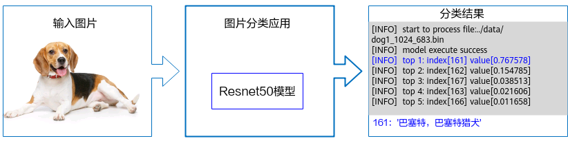

# 快速入门<a name="ZH-CN_TOPIC_0000001273703989"></a>

在本节中，您可以通过一个简单的图片分类应用了解使用AscendCL接口开发应用的基本过程以及开发过程中涉及的关键概念。

## 什么是图片分类应用？<a name="zh-cn_topic_0000001225510872_zh-cn_topic_0000001086737739_section359516351284"></a>

“图片分类应用”，从名称上，我们也能直观地看出它的作用：按图片所属的类别来区分图片。



但“图片分类应用”是怎么做到这一点的呢？当然得先有一个能做到图片分类的模型，我们可以直接使用一些训练好的开源模型，也可以基于开源模型的源码进行修改、重新训练，还可以自己基于算法、框架构建适合自己的模型。

鉴于当前我们是入门内容，此处我们直接获取已训练好的开源模型，毕竟这种最简单、最快。此处我们选择的是Caffe框架的ResNet-50模型。

ResNet-50模型的基本介绍如下：

-   输入数据：RGB格式、224\*224分辨率的输入图片
-   输出数据：图片的类别标签及其对应置信度

> **说明：** 
> -   置信度是指图片所属某个类别可能性。
> -   类别标签和类别的对应关系与训练模型时使用的数据集有关，需要查阅对应数据集的标签及类别的对应关系。

## 环境要求<a id ="zh-cn_topic_0000001225510872_section3324848134412"></a>

-   操作系统及架构：CentOS 7.6 x86\_64、CentOS aarch64、Ubuntu 18.04 x86\_64、EulerOS x86、EulerOS aarch64
-   编译器：g++ 或 aarch64-linux-gnu-g++
-   芯片：Atlas 200/300/500 推理产品、Atlas 推理系列产品（配置Ascend 310P AI处理器）、Atlas 训练系列产品
-   python及依赖的库：python3.7.5、Pillow库
-   已在环境上部署昇腾AI软件栈，并配置对应的的环境变量，请参见[Link](https://www.hiascend.com/document/redirect/CannCommunityInstSoftware)中对应版本的CANN安装指南。  
    
    以下步骤中，开发环境指编译开发代码的环境，运行环境指运行算子、推理或训练等程序的环境，运行环境上必须带昇腾AI处理器。开发环境和运行环境可以合设在同一台服务器上，也可以分设，分设场景下，开发环境下编译出来的可执行文件，在运行环境下执行时，若开发环境和运行环境上的操作系统架构不同，则需要在开发环境中执行交叉编译。

## 下载样例<a name="zh-cn_topic_0000001225510872_section127115612012"></a>

请选择其中一种样例下载方式：

-   压缩包方式下载（下载时间较短，但步骤稍微复杂）

    ```
    # 1. samples仓右上角选择 【克隆/下载】 下拉框并选择 【下载ZIP】。     
    # 2. 将ZIP包上传到开发环境中的普通用户家目录中，【例如：${HOME}/ascend-samples-master.zip】。      
    # 3. 开发环境中，执行以下命令，解压zip包。      
    cd ${HOME}     
    unzip ascend-samples-master.zip
    ```

    注：如果需要下载其它版本代码，请先请根据前置条件说明进行samples仓分支切换。

-   命令行方式下载（下载时间较长，但步骤简单）

    ```
    # 开发环境，非root用户命令行中执行以下命令下载源码仓。    
    cd ${HOME}     
    git clone https://gitee.com/ascend/samples.git
    ```

    注：如果需要切换到其它tag版本，以v0.5.0为例，可执行以下命令。

    ```
    git checkout v0.5.0
    ```


下载成功后，切换到“ <SAMPLE_DIR>/cplusplus/level2_simple_inference/1_classification/resnet50_firstapp”目录下，查看该样例的目录结构，**下文所有的操作步骤均需先切换到resnet50_firstapp目录**：

```
resnet50_firstapp
├── data                                // 用于存放测试图片的目录

├── model                               // 用于存放模型文件的目录                 

├── script
│   ├── transferPic.py                  // 将测试图片预处理为符合模型要求的图片
                                        // 主要是将*.jpg转换为*.bin，同时将图片从1024*683的分辨率缩放为224*224

├── src
│   ├── CMakeLists.txt                  // 编译脚本
│   ├── main.cpp                        // 主函数，图片分类样例的代码文件
```

## 准备模型<a name="zh-cn_topic_0000001225510872_zh-cn_topic_0000001086737739_section1031118381687"></a>

1. 以运行用户登录开发环境。

2.  执行模型转换。

    执行以下命令（以昇腾310 AI处理器为例），将原始模型转换为昇腾AI处理器能识别的\*.om模型文件。请注意，执行命令的用户需具有命令中相关路径的可读、可写权限。以下命令中的“***<SAMPLE_DIR>***”请根据实际样例包的存放目录替换、“***<soc_version>***”请根据实际昇腾AI处理器版本替换。

    ```
    cd <SAMPLE_DIR>/cplusplus/level2_simple_inference/1_classification/resnet50_firstapp/model
    wget https://obs-9be7.obs.cn-east-2.myhuaweicloud.com/003_Atc_Models/resnet50/resnet50.onnx
    atc --model=resnet50.onnx --framework=5 --output=resnet50 --input_shape="actual_input_1:1,3,224,224"  --soc_version=<soc_version>
    ```
    
    -   --model：ResNet-50网络的模型文件路径。
    -   --framework：原始框架类型。5表示ONNX。
    -   --output：resnet50.om模型文件的路径。若此处修改模型文件名及存储路径，则需要同步修改src/main.cpp中模型加载处的模型文件名及存储路径，即modelPath变量值，修改代码后需要重新编译。
    -   --soc\_version：昇腾AI处理器的版本。
    
    关于各参数的详细解释，请参见[《ATC工具使用指南》](https://www.hiascend.com/document/redirect/CannCommunityAtc)。

## 准备测试图片<a name="zh-cn_topic_0000001225510872_zh-cn_topic_0000001086737739_section367813220018"></a>

单击[Link](https://obs-9be7.obs.cn-east-2.myhuaweicloud.com/models/aclsample/dog1_1024_683.jpg)获取测试图片dog1_1024_683.jpg，放到“resnet50_firstapp/data“目录下。若此处修改测试图片文件名，则需要同步修改src/main.cpp中读取图片处的文件名，即picturePath变量值，修改代码后需要重新编译。

此处获取的是一个\*.jpg图片，与模型对图片的要求不符，为了不影响您学习入门知识，我们在该样例下提供了resnet50_firstapp/script/transferPic.py脚本用于将该测试图片转换为模型要求的图片（RGB格式、分辨率为224\*224），该脚本被封装在编译脚本中，执行编译脚本时会自动执行图片转换操作。


## 编译及运行应用<a name="zh-cn_topic_0000001225510872_section7235555174011"></a>

1. 编译代码。

   以运行用户登录开发环境，切换到resnet50_firstapp目录下，执行以下命令。
   如下为设置环境变量的示例，<SAMPLE_DIR>表示样例所在的目录，\$HOME/Ascend/ascend-toolkit表示CANN软件包的安装目录，<arch-os>中的arch表示操作系统架构（需根据运行环境的架构选择），os表示操作系统（需根据运行环境的操作系统选择）。

   ```
   export APP_SOURCE_PATH=<SAMPLE_DIR>/cplusplus/level2_simple_inference/1_classification/resnet50_firstapp
   export DDK_PATH=$HOME/Ascend/ascend-toolkit/latest
   export NPU_HOST_LIB=$HOME/Ascend/ascend-toolkit/latest/<arch-os>/devlib
   chmod +x sample_build.sh
   ./sample_build.sh
   ```
   >**说明：** 
   >如果执行脚本报错“ModuleNotFoundError: No module named 'PIL'”，则表示缺少Pillow库，请使用 **pip3 install Pillow --user** 命令安装Pillow库。
   >
   >如果执行脚本报错“bash: ./sample_build.sh: /bin/bash^M: bad interpreter: No such file or directory”，是由于开发环境中没有安装dos2unix包，需使用**sudo apt-get install dos2unix**命令安装dos2unix包后，执行**dos2unix sample_build.sh**，然后再执行脚本。


2.  运行应用。

    以运行用户将resnet50_firstapp目录上传至运行环境，以运行用户登录运行环境，切换到resnet50_firstapp目录下，执行以下命令。

    ```
    chmod +x sample_run.sh
    ./sample_run.sh
    ```

    终端上屏显的结果如下，index表示类别标识、value表示该分类的最大置信度：

    ```
    top 1: index[162] value[0.954676]
    top 2: index[161] value[0.033442]
    top 3: index[166] value[0.006534]
    top 4: index[167] value[0.004561]
    top 5: index[163] value[0.000315]
    ```

    >**说明：** 
    >类别标签和类别的对应关系与训练模型时使用的数据集有关，本样例使用的模型是基于imagenet数据集进行训练的，您可以在互联网上查阅对应数据集的标签及类别的对应关系，例如，可单击[Link](https://blog.csdn.net/weixin_44676081/article/details/106755135)查看。
    >当前屏显信息中的类别标识与类别的对应关系如下：
    >
    >"162": ["beagle"]
    >
    >"161": ["basset", "basset hound"]
    >
    >"166": ["Walker hound", "Walker foxhound"]
    >
    >"167": ["English foxhound"]
    >
    >"163": ["bloodhound", "sleuthhound"]